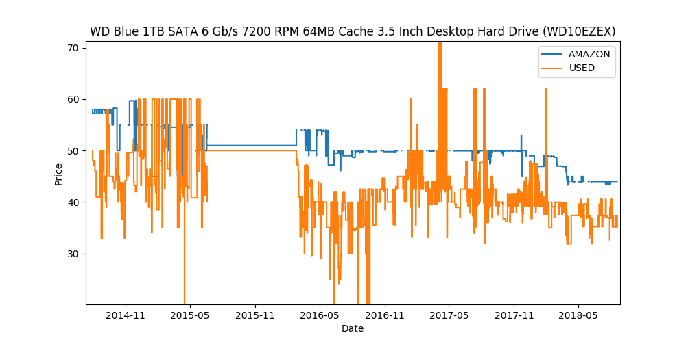
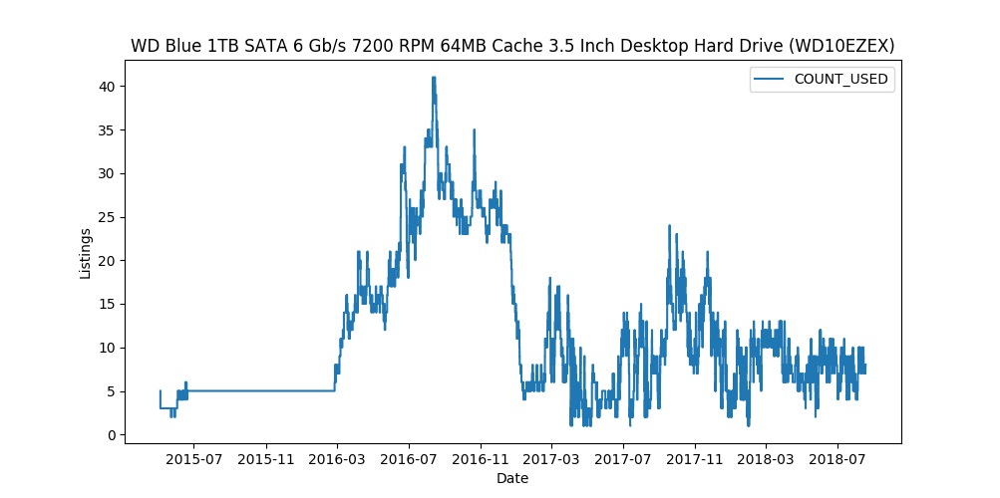

keepaAPI Documentation
======================
This Python module allows you to interface with the API at `Keepa <https://keepa.com/>`_ to query for Amazon product information and history.  It also contains a plotting module to allow for plotting of a product.

.. toctree::
   :maxdepth: 2
   :caption: Contents:

   product_query

Brief Example
-------------
Here's an example of obtaining a product and plotting it's price and offer history:

.. code:: python

    import keepaAPI

    # establish interface with keepa (need real key)
    mykey = '0000000000000000000000000000000000000000000000000000000000000000'
    api = keepaAPI.API(mykey)

    # plot product request 
    request = 'B0088PUEPK'
    products = api.ProductQuery(request)
    product = products[0]
    keepaAPI.PlotProduct(product)

    Product Price Plot

    Product Offers Plot

Installation
------------
``keepaAPI`` can be installed from PyPi using

.. code::

    pip install keepaAPI --user

Source code can also be downloaded from `GitHub <https://github.com/akaszynski/keepaAPI>`_ and installed using:

.. code::

   python setup.py install

Acknowledgments
---------------
This Python code written by Alex Kaszynski, is based on Java code written by Marius Johann, CEO keepa. Java source is can be found at `keepa <https://github.com/keepacom/api_backend/>`_.

License
-------
Apache License, please see license file. Work is credited to both Alex Kaszynski and Marius
Johann.

.. toctree::
   :maxdepth: 2
   :caption: Contents:

Indices and tables
==================
* :ref:`genindex`
* :ref:`modindex`
* :ref:`search`
o
