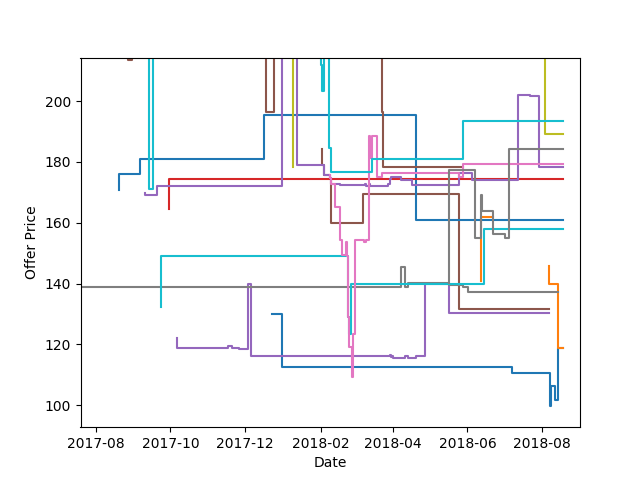

Offer Queries
=============
Set ``offers`` between 20 and 100 to include marketplace offers. Offer queries
consume more tokens than metadata-only product queries.

.. code-block:: python

   product = api.query("1454857935", offers=20)[0]
   offers = product.get("offers", [])

Offer History
-------------
Each offer can contain an ``offerCSV`` history. Convert it into timestamp and
price arrays with ``convert_offer_history``.

.. code-block:: python

   offer = offers[0]
   times, prices = keepa.convert_offer_history(offer["offerCSV"])

   for timestamp, price in list(zip(times, prices))[:10]:
       print(timestamp, price)

Active Offers
-------------
``liveOffersOrder`` contains indices into ``offers`` for currently active
offers. Not every historical offer is active, and the field can be absent.

.. code-block:: python

   active_offers = [
       offers[index]
       for index in product.get("liveOffersOrder", [])
       if index < len(offers)
   ]

   for offer in active_offers:
       times, prices = keepa.convert_offer_history(offer["offerCSV"])

   Active offer price histories

Typed Offers
------------
With ``typed=True``, ``product.offers`` contains ``Offer`` models and
``product.liveOffersOrder`` contains the active indices. Both are optional.

See Keepa's `product request documentation
<https://keepa.com/#!discuss/t/request-products/110/1>`_ for offer-specific
token costs and backend behavior.
