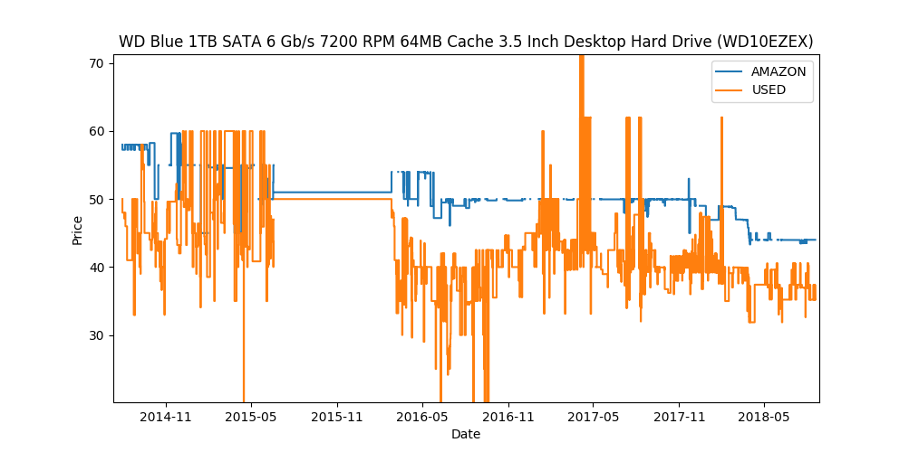

Product History and Statistics
==============================
With ``history=True`` (the default), Keepa history is parsed into NumPy arrays
under ``product["data"]``. Each available value array has a matching
``*_time`` array.

History Availability
--------------------
Products do not necessarily contain every history type. Use ``get`` when
availability is not guaranteed.

.. code-block:: python

   product = api.query("059035342X")[0]
   history = product.get("data", {})
   new_prices = history.get("NEW", [])
   new_times = history.get("NEW_time", [])

   for timestamp, price in list(zip(new_times, new_prices))[:10]:
       print(timestamp, price)

Common History Keys
-------------------

==========================  =================================================
Key                         Meaning
==========================  =================================================
``AMAZON``                  Amazon price
``NEW`` / ``USED``          Marketplace new or used price
``SALES``                   Sales rank
``LISTPRICE``               List price
``NEW_FBA``                 Lowest new Fulfilled by Amazon price
``NEW_FBM_SHIPPING``        Lowest merchant-fulfilled new price with shipping
``BUY_BOX_SHIPPING``        Buy box price with shipping
``COUNT_NEW``               New offer count
``RATING``                  Rating history
``COUNT_REVIEWS``           Review count history
==========================  =================================================

Plotting
--------
History values are discontinuous and are best represented as step plots.

.. code-block:: python

   import matplotlib.pyplot as plt

   if "NEW" in history:
       plt.step(history["NEW_time"], history["NEW"], where="pre")
       plt.xlabel("Date")
       plt.ylabel("New price")
       plt.show()

The convenience plotter renders the available product histories directly:

.. code-block:: python

   keepa.plot_product(product)

   Amazon and marketplace price history

Named Statistics
----------------
Request statistics with ``stats``. Raw positional arrays remain under
``product["stats"]`` for compatibility; ``stats_parsed`` maps positions to
names such as ``AMAZON``, ``NEW``, and ``SALES``.

.. code-block:: python

   product = api.query("059035342X", stats=90)[0]
   stats = product.get("stats_parsed", {})

   current_amazon_price = stats.get("current", {}).get("AMAZON")
   minimum_new_price = stats.get("minInInterval", {}).get("NEW")

Minimum and maximum entries are ``(timestamp, value)`` tuples when present.
Keepa's `statistics object documentation
<https://keepa.com/#!discuss/t/statistics-object/1308>`_ defines the interval
semantics.

Typed Products
--------------
Typed queries preserve the same parsed ``data`` and ``stats_parsed``
convenience attributes when their source data is available. They are
client-generated extras rather than backend schema fields.
