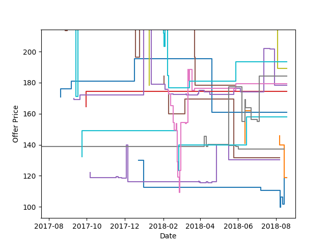

Queries
=======
Interfacing with the ``keepa`` requires a valid access key.  This
requires a monthly subscription from `Pricing
<https://keepa.com/#!api>`_.  Here's a brief description of the
subscription model from their website.

All plans are prepaid for 1 month with a subscription model. A
subscription can be canceled at any time. Multiple plans can be active
on the same account and an upgrade is possible at any time, a
downgrade once per month. The plans differentiate by the number of
tokens generated per minute. For example: With a single token you can
retrieve the complete data set for one product. Unused tokens expire
after one hour. You can find more information on how our plans work in
our documentation.

Connecting to Keepa
~~~~~~~~~~~~~~~~~~~
Import interface and establish connection to server:

.. code:: python

    import keepa
    accesskey = 'XXXXXXXXXXXXXXXX' # enter real access key here
    api = keepa.Keepa(accesskey)

Product History Query
~~~~~~~~~~~~~~~~~~~~~
The product data for a single ASIN can be queried using:

.. code:: python

    products = api.query('059035342X')
    product = products[0]

where ``products`` is always a list of products, even with a single request.

You can query using ISBN-10 or ASIN like the above example by default, or by using UPC,
 EAN, and ISBN-13 codes by setting ``product_code_is_asin`` to ``False``:

.. code:: python

    products = api.query('978-0786222728', product_code_is_asin=False)

Multiple products can be queried using a list or ``numpy`` array:

.. code:: python

    asins = ['0022841350', '0022841369', '0022841369', '0022841369']
    asins = np.asarray(['0022841350', '0022841369', '0022841369', '0022841369'])
    products = api.query(asins)
    product = products[0]

The ``products`` variable is a list of product data with one entry per successful result from the Keepa server. Each entry is a dictionary containing the same product data available from `Amazon <http://www.amazon.com>`_:

.. code:: python

    # Available keys
    print(products[0].keys())

    # Print ASIN and title
    print('ASIN is ' + products[0]['asin'])
    print('Title is ' + products[0]['title'])

When the parameter ``history`` is ``True`` (enabled by default), each
product contains a The raw data is contained within each product
result. Raw data is stored as a dictionary with each key paired with
its associated time history.

.. code:: python

    # Access new price history and associated time data
    newprice = product['data']['NEW']
    newpricetime = product['data']['NEW_time']

    # print the first 10 prices
    print('%20s   %s' % ('Date', 'Price'))
    for i in range(10):
        print('%20s   $%.2f' % (newpricetime[i], newprice[i]))

.. code::

    Date   Price
    2014-07-31 05:00:00   $55.00
    2014-08-02 11:00:00   $56.19
    2014-08-04 02:00:00   $56.22
    2014-08-04 06:00:00   $54.99
    2014-08-08 01:00:00   $49.99
    2014-08-08 16:00:00   $55.66
    2014-08-10 02:00:00   $49.99
    2014-08-10 07:00:00   $55.66
    2014-08-10 18:00:00   $57.00
    2014-08-10 20:00:00   $52.51

Each time a user makes a query to keepa as well as other points in
time, an entry is stored on their servers.  This means that there will
sometimes be gaps in the history followed by closely spaced entries
like in this example data.

The data dictionary contains keys for each type of history available
for the product.  These keys include:

    AMAZON
        Amazon price history

    NEW
        Marketplace/3rd party New price history - Amazon is considered to be part of the marketplace as well, so if Amazon has the overall lowest new (!) price, the marketplace new price in the corresponding time interval will be identical to the Amazon price (except if there is only one marketplace offer).  Shipping and Handling costs not included!

    USED
        Marketplace/3rd party Used price history

    SALES
        Sales Rank history. Not every product has a Sales Rank.

    LISTPRICE
        List Price history

    COLLECTIBLE
        Collectible Price history

    REFURBISHED
        Refurbished Price history

    NEW_FBM_SHIPPING
        3rd party (not including Amazon) New price history including shipping costs, only fulfilled by merchant (FBM).

    LIGHTNING_DEAL
        3rd party (not including Amazon) New price history including shipping costs, only fulfilled by merchant (FBM).

    WAREHOUSE
        Amazon Warehouse Deals price history. Mostly of used condition, rarely new.

    NEW_FBA
         Price history of the lowest 3rd party (not including Amazon/Warehouse) New offer that is fulfilled by Amazon

    COUNT_NEW
         New offer count history

    COUNT_USED
        Used offer count history

    COUNT_REFURBISHED
         Refurbished offer count history

    COUNT_COLLECTIBLE
         Collectible offer count history

    RATING
         The product's rating history. A rating is an integer from 0 to 50 (e.g. 45 = 4.5 stars)

    COUNT_REVIEWS
        The product's review count history.

    BUY_BOX_SHIPPING
        The price history of the buy box. If no offer qualified for the buy box the price has the value -1. Including shipping costs.

    USED_NEW_SHIPPING
        "Used - Like New" price history including shipping costs.

    USED_VERY_GOOD_SHIPPING
        "Used - Very Good" price history including shipping costs.

    USED_GOOD_SHIPPING
        "Used - Good" price history including shipping costs.

    USED_ACCEPTABLE_SHIPPING
        "Used - Acceptable" price history including shipping costs.

    COLLECTIBLE_NEW_SHIPPING
        "Collectible - Like New" price history including shipping costs.

    COLLECTIBLE_VERY_GOOD_SHIPPING
        "Collectible - Very Good" price history including shipping costs.

    COLLECTIBLE_GOOD_SHIPPING
        "Collectible - Good" price history including shipping costs.

    COLLECTIBLE_ACCEPTABLE_SHIPPING
        "Collectible - Acceptable" price history including shipping costs.

    REFURBISHED_SHIPPING
        Refurbished price history including shipping costs.

    TRADE_IN
        The trade in price history. Amazon trade-in is not available for every locale.

Each data key has a corresponding ``_time`` key containing the time
values of each key.  These can be plotted with:

.. code:: python

    import matplotlib.pyplot as plt
    key = 'TRADE_IN'
    history = product['data'] 
    plt.step(history[key], history[key + '_time'], where='pre')

Historical data should be plotted as a step plot since the data is
discontinuous.  Values are unknown between each entry.

The product history can also be plotted from the module if
``matplotlib`` is installed

.. code:: python

    keepa.plot_product(product)

Offer Queries
~~~~~~~~~~~~~
You can obtain the offers history for an ASIN (or multiple ASINs) using the ``offers`` parameter.  See the documentation at `Request Products <https://keepa.com/#!discuss/t/request-products/110/1>`_ for further details.  Offer queries use more tokens than a normal request.  Here's an example query

.. code:: python

    asin = '1454857935'
    products = api.query(asin, offers=20)
    product = products[0]
    offers = product['offers']

    # each offer contains the price history of each offer
    offer = offers[0]
    csv = offer['offerCSV']

    # convert these values to numpy arrays
    times, prices = keepa.convert_offer_history(csv)

    # print the first 10 prices
    print('%20s   %s' % ('Date', 'Price'))
    for i in range(10):
        print('%20s   $%.2f' % (times[i], prices[i]))

.. code::

    Date                  Price
    2017-01-17 11:22:00   $155.41
    2017-04-07 10:40:00   $165.51
    2017-06-30 18:56:00   $171.94
    2017-09-13 03:30:00   $234.99
    2017-09-16 12:16:00   $170.95
    2018-01-30 08:44:00   $259.21
    2018-02-01 08:40:00   $255.97
    2018-02-02 08:36:00   $211.91
    2018-02-03 08:32:00   $203.48
    2018-02-04 08:40:00   $217.37

Not all offers are active and some are only historical. The following
example plots the history of active offers for a single Amazon product.

.. code:: python

    # for a list of active offers, use
    indices = product['liveOffersOrder']

    # with this you can loop through active offers:
    indices = product['liveOffersOrder']
    offer_times = []
    offer_prices = []
    for index in indices:
        csv = offers[index]['offerCSV']
        times, prices = keepa.convert_offer_history(csv)
        offer_times.append(times)
        offer_prices.append(prices)p

    # you can aggregate these using np.hstack or plot at the history individually
    import matplotlib.pyplot as plt
    for i in range(len(offer_prices)):
        plt.step(offer_times[i], offer_prices[i])

    plt.xlabel('Date')
    plt.ylabel('Offer Price')
    plt.show()

Category Queries
~~~~~~~~~~~~~~~~
You can retrieve an ASIN list of the most popular products based on
sales in a specific category or product group.  Here's an example that
assumes you've already setup your api.

.. code:: python

    # get category id numbers for chairs
    if test_categories:
        categories = api.search_for_categories('chairs')
    
        # print the first 5 catIds
        catids = list(categories.keys())
        for catid in catids[:5]:
            print(catid, categories[catid]['name'])
    
        # query the best sellers for "Arm Chairs"
        bestsellers = api.best_sellers_query('402283011')

    print('\nBest Sellers:')
    for bestseller in bestsellers:
        print(bestseller)

.. code::

    8728936011 Stools, Chairs & Seat Cushions
    16053799011 Mamagreen Outdoor Dining Chairs
    8297445011 Medical Chairs
    3290537011 kitchen chairs
    5769032011 Office Chairs

    Best Sellers:
    B00HGE0MT2
    B006W6U006
    B006Z8RD60
    B006Z8S6UC
    B009UVKXY8
    B009FXIVMC
    B0077LGFTK
    B0078NISRY
    B00ESI56B8
    B00EOQ5W8G

Product Search
~~~~~~~~~~~~~~
You can search for products using ``keepa`` using the ``product_finder`` method.  There are many parameters you can search using.  See ``help(api.product_finder)`` or check the description of the function at :ref:`ref_api_methods`.

.. code:: python

    Query for all of Jim Butcher's books:

    import keepa
    api = keepa.Keepa('ENTER_ACTUAL_KEY_HERE')
    product_parms = {'author': 'jim butcher'}
    products = api.product_finder(product_parms)
